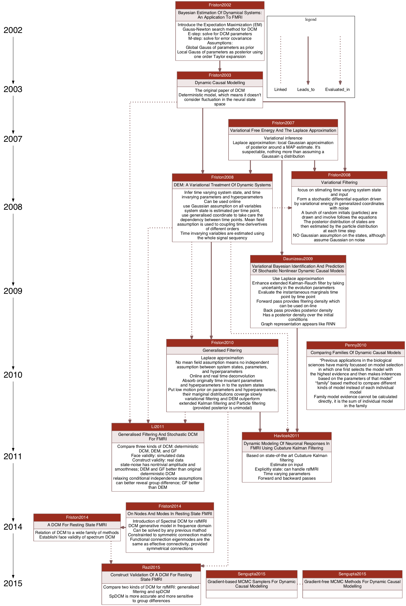

# reference_graph
Scientific references visualization tools implemented with bash.

It visualizes relationship between references on a graph.
The references are arranged vertically by publishing year.
Each node is a reference, containing its short ID, title, and notes.

Here is an example.

